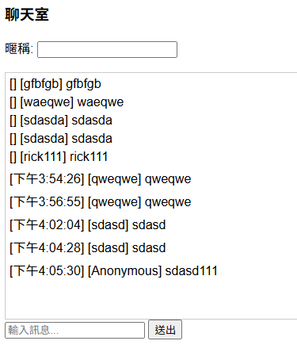

# Live Chat Demo

---

## Description

This is a simple real-time chat application allows all participants in the chat to see messages instantly.  

### Deployment & Services
- **Compute**: GCP Cloud Run, Firebase  
- **Database**: MongoDB Atlas (hosted on GCP)  
- **Frontend**: React (Shadcn/UI and Tailwind CSS)
- **Backend**: Golang(Gin)  
- **Real-time Communication**: WebSocket

---

## Todo List 📝

### Dev Environment
- [X] Local dev env

### User Features
- [ ] Member login function

### Cloud / Deployment
- [X] GCP cloud run set up
- [X] Firebase set up
- [X] Mongo Atlas(GCP) set up
- [X] Build BE on GCP cloud run
- [X] Build FE on firebase

### AI Features
- [ ] AI feature research
- [ ] Add some AI feature to project

### Security
- [ ] XSS prevention (Content Security Policy, escaping)
- [ ] CSRF protection
- [ ] Authentication & authorization checks

### Tools / Maintenance
- [ ] Others (linter, CI/CD, etc.)

---

## Local Dev env Related

### Install and Build Env
docker compose build & docker compose up --no-attach mongodb

### Dev Env Debugging
docker compose logs -f app

### Remove Env
docker compose down -v

## Use Firebase to upload static resources

### Install Firebase CLI
npm install -g firebase-tools
firebase login

### Init firebase (cd to your project folder)
firebase init hosting

### Deploy to firebase
firebase deploy --only hosting

### Local dev testing env (option)
firebase serve --only hosting

### remove cache
rm -rf .firebase/
